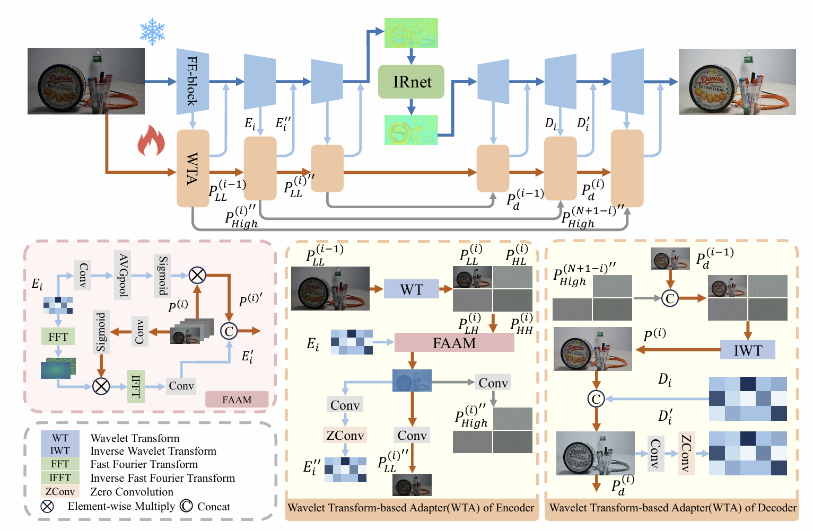

# DreamUHD: Frequency Enhanced Variational Autoencoder for Ultra-High-Definition Image Restoration
## Introduction
This repository provides the official implementation for the paper, "DreamUHD: Frequency Enhanced Variational Autoencoder for Ultra-High-Definition Image Restoration."  DreamUHD is a novel framework designed to address the challenges inherent in Ultra-High-Definition (UHD) image restoration. By leveraging the powerful latent space representation and reconstruction capabilities of Variational Autoencoders (VAEs) and integrating frequency priors, our method effectively restores high-quality UHD images while maintaining computational efficiency. 


## Key Features
- VAE-Based UHD Image Restoration: To the best of our knowledge, this is the first work to introduce VAEs into the domain of UHD image restoration. By operating in the compact latent space of a VAE, our framework enhances restoration consistency and significantly reduces computational overhead.
- Frequency-Enhanced VAE (FE-VAE): We propose a novel Fourier-based, frequency-enhanced VAE that is both lightweight and powerful. By incorporating the global perceptual capabilities of the Fourier domain, FE-VAE achieves a substantial reduction in parameter count and computational cost without compromising its representational power.
- Wavelet Transform-based Adapter (WTA): A wavelet-based adapter is introduced to supplement the high-frequency details essential for high-fidelity image restoration. This module effectively bridges the domain gap between the pre-trained VAE and degraded images by combining spatial and frequency information.
- State-of-the-Art Performance: Our proposed method has been extensively evaluated on a variety of UHD image restoration tasks, including low-light enhancement, image deblurring, image dehazing, and moiré pattern removal. In all cases, DreamUHD achieves state-of-the-art results, outperforming existing methods both qualitatively and quantitatively. 


## Framework Overview
The DreamUHD framework is composed of three main components:
- A frozen, pre-trained FE-VAE: This serves as the backbone of our model, providing an efficient and compact latent space for image representation. 
- A Wavelet Transform-based Adapter (WTA): This module works in tandem with the FE-VAE to inject high-frequency information and mitigate the domain gap.
- An arbitrary restoration network (IRNet): This is a lightweight network that performs the actual restoration task within the latent space. 




## Environment Setup
- Python 3.8+
- PyTorch (CUDA recommended)
- Recommended packages (see scripts):

Quick install (mirror example):
```bash
pip3 install PyWavelets packaging lpips opencv-python einops scikit-image torchmetrics omegaconf tensorboard thop lmdb matplotlib timm openai-clip pandas facexlib sentencepiece future icecream imgaug accelerate addict transformers==4.37.2 pyiqa
```


## Repository Structure
- `basicsr/`: training/validation pipelines, models, architectures, losses, metrics, data
- `options/`: YAML configs for VAE pretraining and DreamUHD tasks
- `inference.py`: single/multi-image inference entry
- `train.sh`, `test.sh`, `test_VAE.sh`: usage examples
- `metrics.py`, `calculate_psnr_ssim.py`: evaluation utilities
- `weight/`: place pretrained weights here (see below)


## Datasets
Update the dataset paths in the YAMLs under `options/` to your local locations.
- Low-light example (`options/DreamUHD_LL.yml`):
  - Train: `./data/UHD_LL/training_set/{input,gt}`
  - Val/Test: `./data/UHD_LL/test/{input,gt}`
- Dehaze example (`options/DreamUHD_haze.yml`):
  - Train: `./data/UHD_haze/train/{input,gt}`
  - Test: `./data/UHD_haze/test/{input,gt}`
- Deblur example (`options/DreamUHD_bulr.yml`):
  - Train: `./data/UHD_deblur/train/{input_new,gt_new}`
  - Test: `./data/UHD_deblur/test/...`

If you pretrain the FE-VAE, point `vae_weight` and `config` to the VAE checkpoint and config.


## Pretrained Weights
Place weights in `weight/` or provide relative paths:
- FE-VAE for low-light: `weight/VAE_LL.pth` (update in YAML: `network_g.vae_weight`)
- Task weights:
  - Low-light: `weight/DreamUHD_lowlight.pth`
  - Dehaze: `weight/DreamUHD_haze.pth`


## Training
Use `basicsr/train.py` with a task YAML in `options/`.
Example (low-light):
```bash
python ./basicsr/train.py -opt ./options/DreamUHD_LL.yml
```
Notes:
- Adjust `datasets.*` paths and `logger` settings in the YAML.
- EMA: some configs use `param_key: params_ema`; ensure your weights match.

VAE pretraining (optional):
```bash
python ./basicsr/train.py -opt ./options/VAE_LL.yml
```


## Inference
Single-folder inference with a task config and weight:
```bash
python ./inference.py \
  --config ./options/DreamUHD_haze.yml \
  --input  ./data/UHD_haze/test/input \
  --weight ./weight/DreamUHD_haze.pth \
  --output ./exp/haze
```
Common flags:
- `--test_tile`: enable tiled inference
- `--max_size`: max image size for whole-image inference (otherwise tiles)

Example (low-light):
```bash
python ./inference.py \
  --config ./options/DreamUHD_LL.yml \
  --input ./data/UHD_LL/test/input \
  --weight ./weight/DreamUHD_lowlight.pth \
  --output ./exp/LL
```


## Evaluation
Compute PSNR/SSIM on results:
```bash
python ./calculate_psnr_ssim.py \
  --gt_path ./data/UHD_haze/test/gt \
  --results_path ./exp/haze \
  --test_log ./test.log
```


## Results


## Configuration
Key fields in `options/DreamUHD_*.yml`:
- `datasets`: paired datasets (`PairedImageDataset`) with `dataroot_lq`/`dataroot_gt`
- `network_g`: `type: DreamUHD` with VAE settings
  - `vae_weight`, `config`: path to FE-VAE checkpoint and its config
  - `param_key`: e.g., `params_ema` when using EMA weights
- `train`: optimizers, schedulers, and loss weights (L1, SSIM, FFT, LPIPS, GAN)
- `logger`: frequencies, TensorBoard/W&B

VAE configs (`options/VAE_*.yml`) use `model_type: VAEModel` and `network_g: AutoencoderKL_freup2`.


## Reproducing Paper Results
- Train or download FE-VAE weights, set `network_g.vae_weight` and `config` in your task YAML.
- Train task-specific DreamUHD model with corresponding YAML.
- Run inference and evaluate with the provided scripts.


## Citation
If you find this work helpful, please cite:
```bibtex
@inproceedings{liu2025dreamuhd,
  title={DreamUHD: Frequency Enhanced Variational Autoencoder for Ultra-High-Definition Image Restoration},
  author={Liu, Yidi and Li, Dong and Xiao, Jie and Bao, Yuanfei and Xu, Senyan and Fu, Xueyang},
  booktitle={Proceedings of the AAAI Conference on Artificial Intelligence},
  volume={39},
  number={6},
  pages={5712--5720},
  year={2025}
}
```


## License
This repository is for research purposes. Please check the license terms of any upstream components in `basicsr/`.


